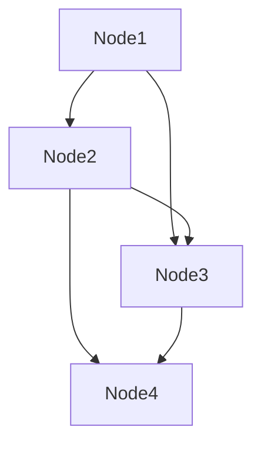

# DataHandleIdea

基于树结构的数据处理。

## Idea

当时数据处理的逻辑、步骤、线路过于复杂的时候，数据处理的整体代码逻辑就难以管理。所以就有了了这个节点式的基于树结构的数据处理的想法。

## Deal With BFS

## Usage

```python3
python3 main.py
```

### Example's Node Relationship


